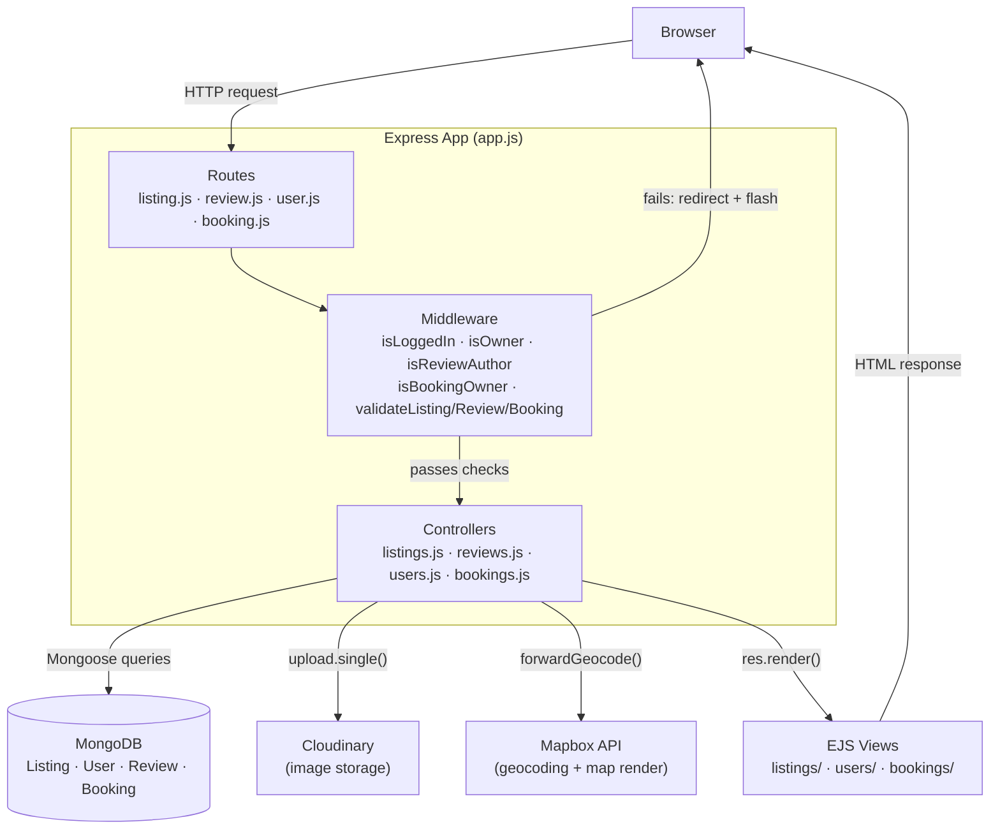
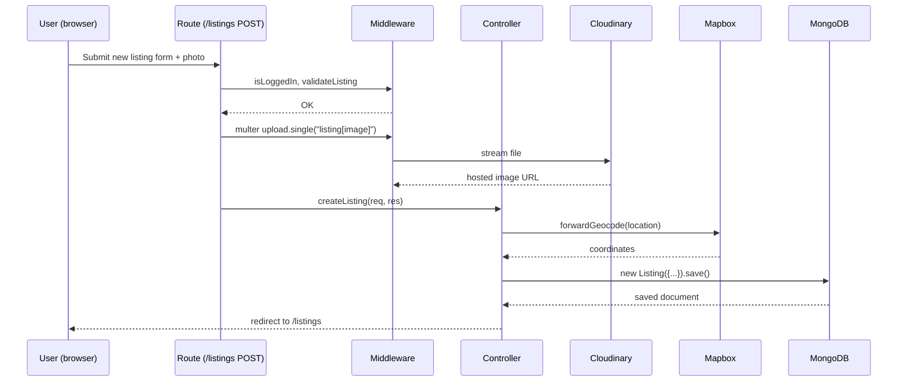

# 🏡 WanderLust

A full-stack, Airbnb-style travel listing app. Users can sign up, list a place to stay, upload photos, leave reviews, and now **book real date ranges** with server-side availability checking.

## ✨ Features

- **Auth** — signup/login/logout via Passport.js (`passport-local-mongoose`), sessions stored in MongoDB
- **Listings** — full CRUD, owner-only edit/delete, Joi-validated input
- **Image upload** — Multer streams uploads straight to Cloudinary
- **Geolocation** — Mapbox geocodes each listing's address into coordinates, rendered on an interactive map
- **Reviews** — star ratings + comments, author-only delete
- **Search** — filter listings by country
- **Bookings** *(new)* — pick check-in/check-out dates on a listing; the server rejects overlapping bookings; guests get a "My Trips" page; owners see who's booked their place

## 🛠️ Tech Stack

| Layer | Tech |
|---|---|
| Server | Node.js, Express 5 |
| Views | EJS + ejs-mate (server-rendered templates) |
| Database | MongoDB + Mongoose |
| Auth | Passport.js, express-session, connect-mongo |
| File storage | Cloudinary + Multer |
| Maps | Mapbox SDK |
| Validation | Joi |

## 🏗️ Architecture

The app follows the standard **MVC** pattern. A request comes in, passes through auth/validation middleware, hits a controller, which reads/writes MongoDB via a Mongoose model and renders an EJS view (or hands off to Cloudinary/Mapbox for uploads and geocoding).



**Request lifecycle example — creating a listing:**



## 📂 Project Structure

```
WanderLust/
├── app.js                 # entry point, middleware & route mounting
├── cloudConfig.js         # Cloudinary + multer-storage-cloudinary setup
├── middleware.js          # auth guards, ownership checks, Joi validation
├── schema.js              # Joi schemas (listing, review, booking)
├── controllers/
│   ├── listings.js
│   ├── reviews.js
│   ├── users.js
│   └── bookings.js
├── models/
│   ├── listing.js
│   ├── review.js
│   ├── user.js
│   └── booking.js
├── routes/
│   ├── listing.js
│   ├── review.js
│   ├── user.js
│   ├── booking.js         # nested under /listings/:id/bookings
│   └── mybookings.js      # top-level /bookings ("My Trips")
├── views/
│   ├── listings/
│   ├── users/
│   ├── bookings/
│   └── includes/, layouts/
├── public/                # static css/js
└── utils/                 # ExpressError, wrapAsync
```

## ⚙️ Local Setup

**Requirements:** Node.js 20+, a MongoDB connection string (Atlas free tier works), a Cloudinary account, a Mapbox access token.

```bash
git clone <your-repo-url>
cd WanderLust
npm install
```

Create a `.env` file in the project root:

```
ATLASDB_URL=your_mongodb_connection_string
SECRET=any_random_session_secret
CLOUD_NAME=your_cloudinary_cloud_name
CLOUD_API_KEY=your_cloudinary_api_key
CLOUD_API_SECRET=your_cloudinary_api_secret
MAP_TOKEN=your_mapbox_access_token
```

Run it:

```bash
node app.js
```

Visit `http://localhost:8080`.

## 🚀 Deployment

Deployed on [Render](https://render.com) as a Node web service (build command `npm install`, start command `node app.js`), with the same environment variables set in Render's dashboard.

## 🎯 Roadmap

- [x] Bookings with availability checking
- [ ] Wishlist / saved listings
- [ ] Payment integration
- [ ] Admin dashboard
- [ ] Real-time notifications

## 📄 License

Educational project.
