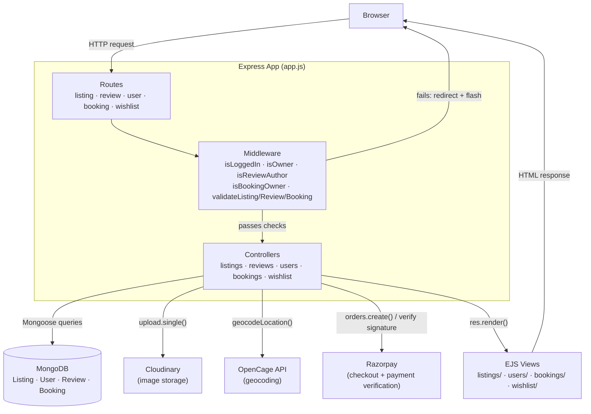
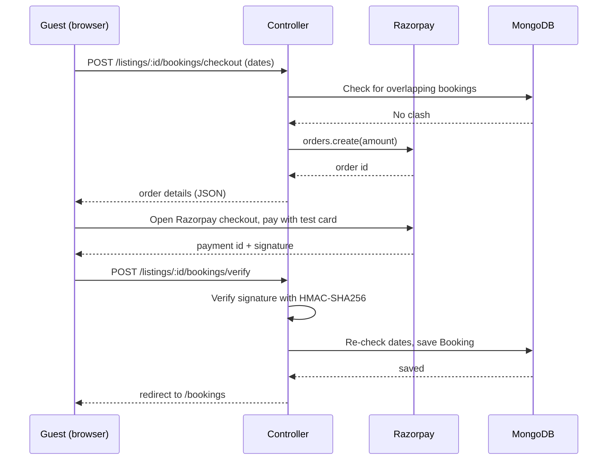

# 🏡 StayScape

A full-stack, Airbnb-style travel booking platform — list a stay, search and browse listings, book real date ranges with live Razorpay payment, leave reviews, save listings to a wishlist, and manage bookings received as a host.

### 🔗 [**Live Demo →** stayscape-a0fz.onrender.com](https://stayscape-a0fz.onrender.com/listings)

The app runs on Render's free tier, so the first request after a period of inactivity can take 20–30 seconds to wake up — give it a moment on first load.

**Test the booking flow** with Razorpay's test card: `4718 6091 0820 4366`, any future expiry, any CVV, any name/mobile/email. No real payment is processed — this is Razorpay's official test environment.

---

## ✨ Features

- **Auth** — signup/login/logout via Passport.js (`passport-local-mongoose`), sessions stored in MongoDB
- **Listings** — full CRUD, owner-only edit/delete, Joi-validated input
- **Image upload** — Multer streams uploads straight to Cloudinary
- **Geolocation** — OpenCage geocodes each listing's address into coordinates; map rendered with MapLibre GL via [OpenFreeMap](https://openfreemap.org) (free, no API key, production-safe — the map even follows the site's light/dark theme)
- **Reviews** — star ratings + comments, author-only delete
- **Search** — matches both location (city/state) and country, case-insensitive partial match
- **Bookings** — real date-range selection with server-side overlap checking, so two guests can never double-book the same dates
- **Payments** — Razorpay checkout integration; a booking is only saved to the database *after* the payment signature is cryptographically verified server-side
- **Wishlist** — save/unsave any listing, view them all on a dedicated page
- **Host dashboard** — "Incoming Bookings" page shows every booking received across *all* listings a user owns, not just one at a time
- **Light/dark theme toggle** — persists via `localStorage`, with an anti-flicker inline script so the page never flashes the wrong theme on load
- **Security** — `helmet` middleware for standard security headers (clickjacking/MIME-sniffing protection)

## 🛠️ Tech Stack

| Layer | Tech |
|---|---|
| Server | Node.js, Express 5 |
| Views | EJS + ejs-mate (server-rendered templates) |
| Database | MongoDB + Mongoose |
| Auth | Passport.js, express-session, connect-mongo |
| File storage | Cloudinary + Multer |
| Payments | Razorpay (Checkout + server-side signature verification) |
| Maps | OpenCage (geocoding) + MapLibre GL via OpenFreeMap (map display) |
| Validation | Joi |
| Security | Helmet |
| Deployment | Render |

## 🏗️ Architecture

The app follows the standard **MVC** pattern. A request passes through auth/validation middleware, hits a controller, which reads/writes MongoDB via a Mongoose model and renders an EJS view — or, for payments, hands off to Razorpay for order creation and signature verification.



**Booking + payment flow — the most involved request in the app:**



## 📂 Project Structure

```
StayScape/
├── app.js                 # entry point, middleware & route mounting
├── cloudConfig.js         # Cloudinary + multer-storage-cloudinary setup
├── razorpayConfig.js      # Razorpay client setup
├── middleware.js          # auth guards, ownership checks, Joi validation
├── schema.js              # Joi schemas (listing, review, booking)
├── controllers/
│   ├── listings.js
│   ├── reviews.js
│   ├── users.js
│   ├── bookings.js        # checkout, payment verification, my trips, incoming bookings
│   └── wishlist.js
├── models/
│   ├── listing.js
│   ├── review.js
│   ├── user.js             # includes wishlist field
│   └── booking.js          # includes Razorpay order/payment IDs
├── routes/
│   ├── listing.js
│   ├── review.js
│   ├── user.js
│   ├── booking.js          # /listings/:id/bookings/checkout, /verify
│   ├── mybookings.js       # /bookings ("My Trips"), /bookings/incoming
│   └── wishlist.js
├── views/
│   ├── listings/
│   ├── users/
│   ├── bookings/           # index (My Trips), incoming (host dashboard)
│   ├── wishlist/
│   └── includes/, layouts/
├── public/
│   ├── css/style.css       # dusk-themed light/dark design system
│   └── js/
│       ├── map.js          # MapLibre GL, theme-aware
│       ├── bookingCheckout.js
│       └── theme.js        # light/dark toggle
└── utils/                  # ExpressError, wrapAsync
```

## ⚙️ Running Locally

**Requirements:** Node.js 20+, a MongoDB connection string (Atlas free tier works), a Cloudinary account, an OpenCage API key (free, no card required), and Razorpay test-mode keys (free, no KYC needed for test mode).

```bash
git clone https://github.com/KushagraSri87/StayScape.git
cd StayScape
npm install
```

Create a `.env` file in the project root:

```
ATLASDB_URL=your_mongodb_connection_string
SECRET=any_random_session_secret
CLOUD_NAME=your_cloudinary_cloud_name
CLOUD_API_KEY=your_cloudinary_api_key
CLOUD_API_SECRET=your_cloudinary_api_secret
OPENCAGE_API_KEY=your_opencage_api_key
RAZORPAY_KEY_ID=your_razorpay_test_key_id
RAZORPAY_KEY_SECRET=your_razorpay_test_key_secret
```

Run it:

```bash
node app.js
```

Visit `http://localhost:8080`.

## 🚀 Deployment

Deployed on [Render](https://render.com) as a Node web service (build command `npm install`, start command `node app.js`), with the same environment variables set in Render's dashboard, and `0.0.0.0/0` whitelisted in MongoDB Atlas's Network Access so Render's servers can connect.

## 🎯 Roadmap

- [x] Bookings with availability checking
- [x] Payment integration (Razorpay)
- [x] Wishlist / saved listings
- [x] Host dashboard for incoming bookings
- [ ] Category filtering (icons currently show "Coming soon")
- [ ] Admin dashboard
- [ ] Real-time notifications

## 📄 License

Educational project.
